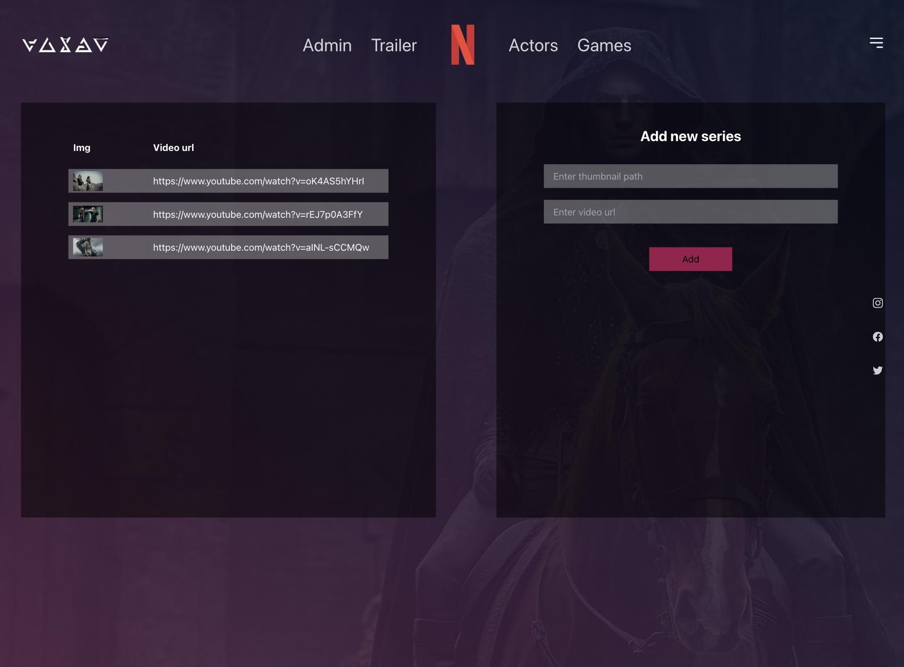
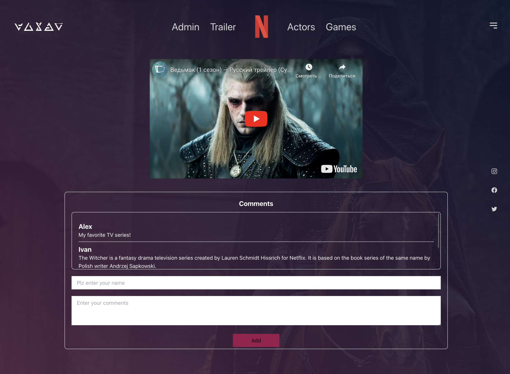
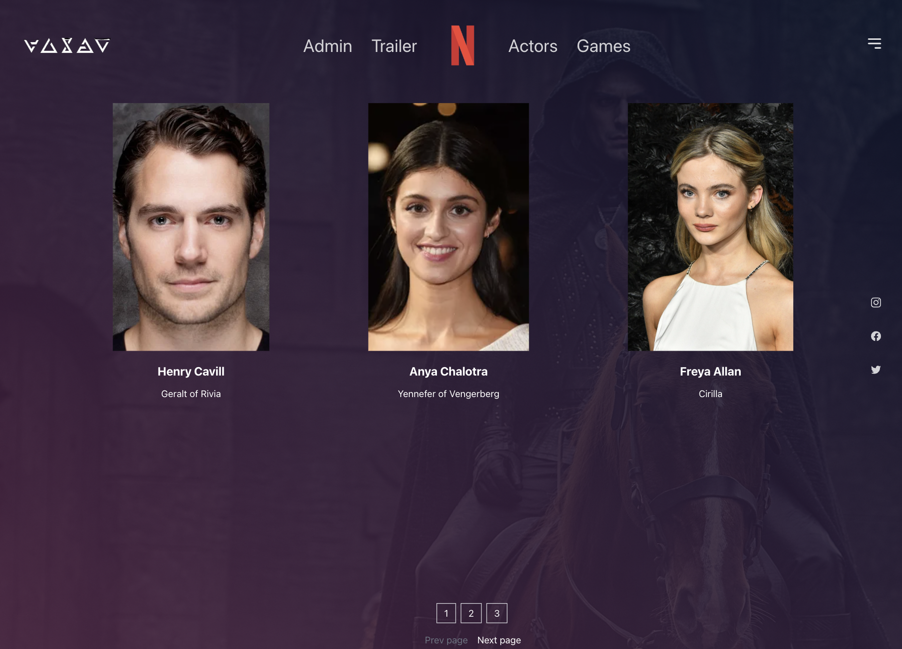

# Проект [theWitcher](https://github.com/AlexFromNorth/TheWitcher) | Frontend / React / Firebase / Tailwindcss

### 📜 Описание:
Web-приложение на `React.js` о "вселенной" Ведьмака. В качестве бд был использован `firebase`, он же использован для реализации админ-панели(добавление новых серий/комментариев).
Созданно с применением `Create React App` и имеет переиспользуемые компоненты. Применена методология БЭМ. 
Для более удобной работы по стилизации был использован `Tailwindcss`

### 📲 Как пользоватся:
* Во вкладке "Admin" можно добавить новое видео, если вставить url-адресс и описание
* Во вкладке "Trailer" можно оставить комментарий

### 🥞 Стек:

`HTML5` `CSS3` `JavaScript ES6+` `React` `БЭМ` `Tailwindcss` `Firebase`

### 💽 Установка и запуск:

1. Склонировать репозиторий в текущую папку:

```git clone https://github.com/AlexFromNorth/TheWitcher.git ./```

2. Установить зависимости:

```npm install```

3. Запустить проект в режиме разработки:

```npm start```

<br />
<br />

<br />
<br />

<br />
<br />

<br />
<br />

<br />
<br />

<br />
